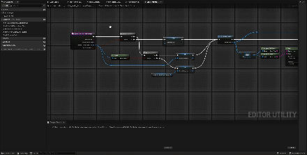

# Editor Helpers Unreal Engine 5 plugin

Simple Blueprint Function Library exposing some c++ only functionalities. 

Right now it's mainly focused towards Tech Anim helpers, such as populating an Animation Montage with different clips and automatically adding sections or notifies, adding sockets to a skeleton and so on.

These functions drastically improved my workflows while working on these features.

I'll try to keep the plugin updated as I add more functionalities for my own needs. Feel free to request features.

## Screenshots

## Demo

## Installation

Create a "Plugins" folder inside your Unreal project and copy the folders "Resources", "Source" from this repo, along the uplugin file inside it.
    
